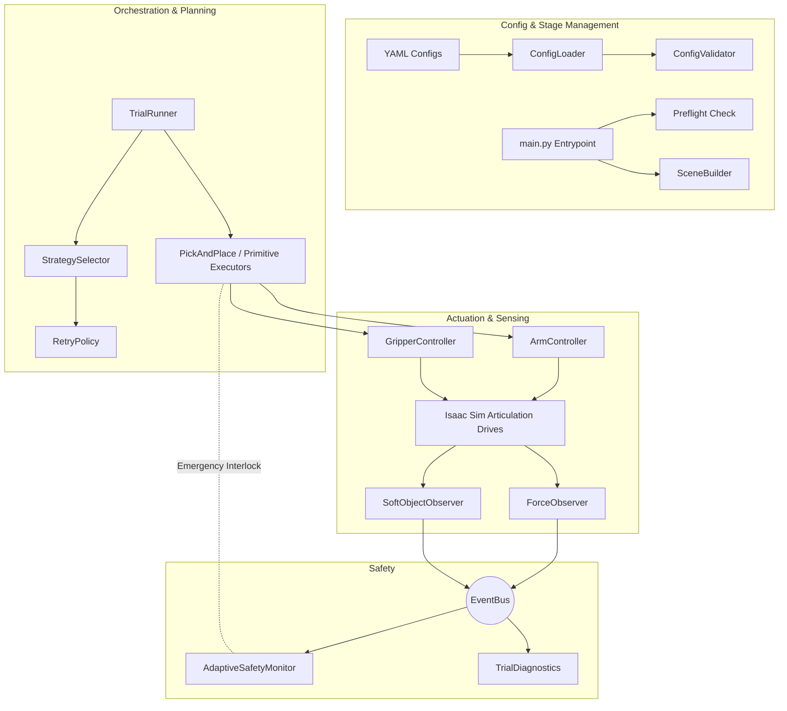
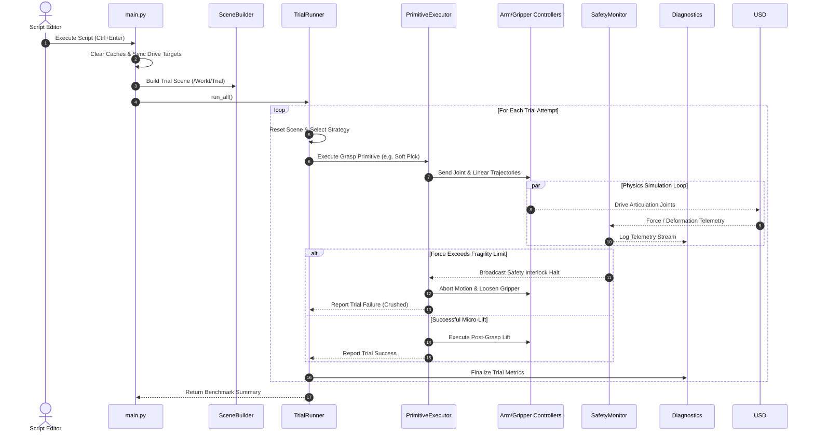

# 🏛️ System Architecture & Execution Lifecycle

This document outlines the software design, modular subsystem breakdown, asynchronous communication patterns, and execution lifecycle of the **UR5e Adaptive Grasping Framework**.

---

## 🌟 Architecture

Robotic manipulation of deformable, fragile, and delicate objects requires tight coupling between sensing and actuation, yet loose coupling across codebase components to maintain scalability. To achieve this balance, the framework employs three core design patterns:

1. **Decoupled Event-Driven Communication**: Rather than passing direct references between controllers and perception observers, subsystems communicate asynchronously via a centralized `EventBus`. This allows observers (`ForceObserver`, `SoftObjectObserver`) to publish high-frequency telemetry without blocking trajectory execution loops.
2. **Declarative Configuration Injection**: Hardware limits, kinematics, and fragile material properties are fully defined in external YAML specifications (`config/`). Code modules validate and ingest these configurations at runtime (`ConfigLoader`, `ConfigValidator`).
3. **Composable Manipulation Primitives**: Complex tasks are broken down into atomic manipulation primitives. These primitives are orchestrated by higher-level executors (`PickAndPlaceExecutor`, `ManipulationPrimitiveExecutor`) that wrap execution in adaptive retry policies.

---

## 🧩 Subsystem Overview

### 1. Stage Initialization & Preflight (`main.py`, `preflight.py`, `scene_builder.py`)
- **`main.py`**: Acts as the simulation bootstrapper. It evicts stale Python module caches (critical when iterating inside Isaac Sim's Script Editor), loads YAML profiles, and initiates physics stepping.
- **`Preflight`**: Verifies USD stage validity, checks for required articulation root paths, and ensures drive targets are synchronized before pressing "Play" (`preplay_sync_ur5e_drives`, `preplay_sync_gripper_drives`). This prevents violent robotic jumps caused by stale target attributes.
- **`SceneBuilder`**: Dynamically spawns `/World/Trial` prim hierarchies, placing target objects (both rigid meshes and compliant soft bodies) onto designated table seating slots with randomized orientation and position seeds.

### 2. Execution Orchestration (`trial_runner.py`, `strategy_selector.py`, `retry_policy.py`)
- **`TrialRunner`**: Manages automated trial iterations. For each run, it resets the USD stage, selects target objects, invokes the strategy pipeline, and records success/failure outcomes.
- **`StrategySelector`**: Evaluates object compliance and fragility profiles loaded from `soft_objects.yaml` to determine the initial approach speed, grasp force threshold, and contact primitive.
- **`RetryPolicy`**: If an initial grasp fails (e.g., slip detected or micro-lift validator registers dropped load), the retry policy dictates dynamic adaptation—such as increasing gripper linear force or adjusting wrist approach angle.

### 3. Actuation Layer (`arm_controller.py`, `gripper_controller.py`, `motion_interface.py`)
- **`ArmController`**: Interfaces with the UR5e 6-DOF articulation joints via OpenUSD `DriveAPI`. Handles inverse kinematics resolution, joint trajectory interpolation, and home pose synchronization.
- **`GripperController`**: Regulates the OnRobot 2FG7 parallel gripper fingers. Manages linear position targets and applies compliance dampening when closing around delicate objects.

### 4. Perception & Safety Layer (`force_observer.py`, `soft_object_observer.py`, `adaptive_safety_monitor.py`)
- **`ForceObserver`**: Extracts normal and shear contact forces from USD physics tensor APIs at gripper finger contact points.
- **`SoftObjectObserver`**: Tracks mesh deformation ratios and material yield metrics. Detects unwanted slipping or structural crushing.
- **`AdaptiveSafetyMonitor`**: Listens to observer streams via the `EventBus`. If measured force exceeds configured fragility thresholds, it immediately broadcasts an interlock signal to freeze arm motion or trigger a safe release.

---

## 🔄 Lifecycle of a Manipulation Trial

---

- **`force_update`**: Payload containing normal contact forces per finger.
- **`object_deformation`**: Payload tracking current object bounding volume vs rest volume.
- **`safety_trigger`**: Emergency broadcast signaling immediate trajectory suspension.
- **`execution/primitive_complete`**: Status notification indicating atomic motion stage termination.
